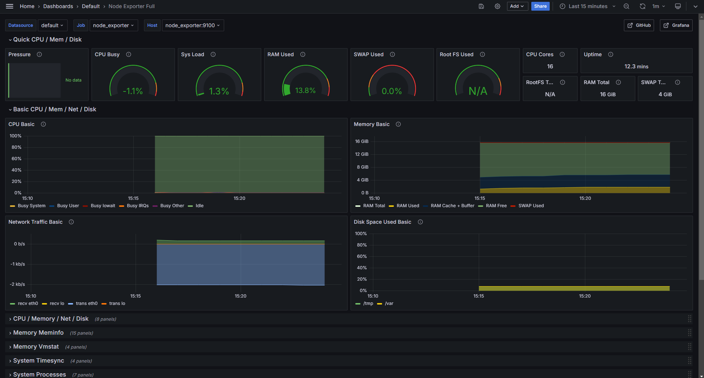

# Docker Compose example

This example demonstrates how to run Grafana Alloy with Docker Compose. The setup includes Grafana, Prometheus, Node Exporter, Grafana Mimir, Grafana Loki, Grafana Tempo, and Grafana Pyroscope. The environment is pre-configured with datasources and dashboards for monitoring Grafana Alloy.

## Prerequisites

Ensure that Docker and Docker Compose are installed and running on your system.

> **NOTE**: This environment is not intended for production use, and is
> maintained on a best-effort basis.

By default, only Grafana and databases are exposed:

- Prometheus, for collecting metrics (`localhost:9090`)
- Node Exporter, for collecting host metrics (`localhost:9100`)
- Grafana, for visualizing telemetry (`localhost:3000`)
- Grafana Mimir, for storing metrics (`localhost:9009`)
- Grafana Loki, for storing logs (`localhost:3100`)
- Grafana Tempo, for storing traces (`localhost:3200`)
- Grafana Pyroscope, for storing profiles (`localhost:4040`)

Grafana is automatically provisioned with the appropriate datasources and
dashboards for monitoring Grafana Alloy.

## Running Alloy

Alloy can either be run locally or within Docker Compose. The [example
configuration](./config/alloy/config.alloy) can be used to send self-monitoring
data from a local Alloy to the various databases running in Docker Compose.

To run Alloy within Docker Compose, pass `--profile=alloy` to `docker compose`
when starting and stopping the environment:

```bash
docker compose --profile=alloy up -d
```

```bash
docker compose --profile=alloy down
```

# Note

- When Alloy starts, you'll notice that install-dashboard-dependencies and provision-dashboards are stopped. This is expected.
- Also, If you don't have an application exporting prometheus, metrics you won't see any data in the relevant dashboards.
  

# Usage

- Proceed to localhost:12345 to view the dashboard:

  

- Click the graph button to see all services and how they interconnect:

  

- To view grafana dashboards, proceed to [localhost:4000/dashboards](http://localhost:4000/dashboards). There you will see a set of Alloy dashboards that have been provisioned, as well as a Node Exporter dashboard.

  

- To view logs, proceed to [localhost:4000/explore](http://localhost:4000/explore). You can:
  - Select the Loki datasource and query logs (You'd have to select an instance).
  - Select the Tempo datasource and query traces.
  - Select the Pyroscope datasource and query profiles.
  - Select the Mimir (Or Prometheus) datasource and query metrics.

# That's it!

You now have a fully functional Grafana Alloy Observability Stack running on your local machine. Feel free to explore the various services and dashboards to monitor your applications and infrastructure.

If you have any questions or feedback, please let us know :)
